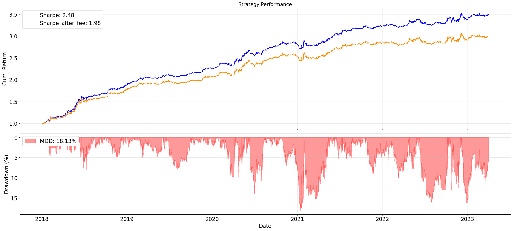

<div align="center">

# <div align="center"><b>VNMiniQuant</b></div>

*A lightweight quantitative toolkit for avid quantitative researcher*

[](https://python.org)
[]()
[]()

</div>

---

## 📌 Introduction

**VNMiniQuant** is a quant research workspace designed to help individual investors/traders develop and backtest their own alphas.
The tool would be especially helpful for Vietnam Stock, Vietnam Future and Crypto.
Enjoy!

---

## 🚀 Usage

### SET UP

```bash
# clone the repo
git clone https://github.com/PeterDingVN/VNMiniQuant.git

# Get into the main work dir
cd VNMiniQuant

# install dependencies
pip install -r requirements.txt
```


### QUICK START
#### Step 1: Build Alpha
- Develop your idea for an alpha. For example, when close > EMA10 go long, else go short.
- From the idea, access ```alpha_sample/MyAlpha.py``` and follow the instruction about an alpha's standard structure.
- Convert your idea into code following that structure.


#### Step 2: Configurate the config file
- Auto pick file with "cfg" or "config" in the name if multiple .json found in ```alpha_sample/```. Named otherwise, only one .json is accepted.
- Config files must have all the keys: ```"tv_username", "tv_password", "update_data", "data", "bt_cfg", "alpha_cfg"```:
  + tv_username and tv_password: used to log into TradingView account, which may provides more data than Guest Mode.
  + update_data: used to tell DataApi whether to scrape new data or reuse data scraped and stored in cache previously. However, auto scrape is still triggered if the data mentioned does not exist in cache.
  + bt_cfg: provide config for backtets engine. Please pay attention to fee_type when backtesting different assets (crypto fee differ from VN future fee). Sometimes, error about "not enough cash" is raised, if so, go increase the init_capital. Other than that, default setting works fine.
  + alpha_cfg: 
    - filename: provide exactly the name of .py file that contains the alpha
    - classname: provide exactly the name of the alpha class that contains core logic (please check out alpha file ```alpha_sample/MyAlpha.py``` for details)
    - alpha_type: currently, only ```ta``` is supported, so leave the default config as it is
    - params: the parameters for your alpha, check out the alpha file for more.
- For an example, check out sample ```MyAlphaCfg.json```.

#### Step 3: Run the alpha
- Go into Research_Space.ipynb and follow the process.
- For most recent updates, check out ```UPDATE_LOG.md```


### OUTPUT

```
========== Financial Backtest Vietnam Future ==========
 
IN SAMPLE PERFORMANCE

    Initial capital: 260,000,000.00
     Ending capital: 780,677,560.41
             Sharpe: 1.98
            Sortino: 2.92
             Calmar: 1.91
                MDD: 47,129,011.34 (18.13%); Time: 2020-10-30 14:00:00 -> 2021-01-13 11:00:00
       Total Profit: 520,677,560.41
   Margin per Trade: 14.59 bps
       Total Return: 180.32%
 Avg. Annual Return: 34.69%
Comp. Annual Return: 21.93%
       Hitrate Long: 47.30%
      Hitrate Short: 46.87%
      Total Hitrate: 47.16%
        Longest Win: 12 days
       Longest Loss: 11 days
      Trade per Day: 0.43
        Long Trades: 287
       Short Trades: 275
```



---

## ⚠️ Disclaimer

- **Data source**: Market data is fetched mainly via Binance, TradingView, Vietstock
- **Timeframe limitation**: Only **daily** OHLCV data is available through the public pipeline. Some additional data used internally (intraday, alternative datasets) comes from private sources and **cannot be published or redistributed**.
- **Not financial advice**: This tool is pure research and backtest environment. No alphas or trading strategies are provided within.


---

## 🔭 Future Roadmap

The following improvements are planned for future releases:
- Add PaperTrading module to allow real-life stress-test the alpha
- Add LiveTrading module and API connection instruction
- Add AlphaDashboard to monitor trades and portfolio performance while in paper trading and live.

